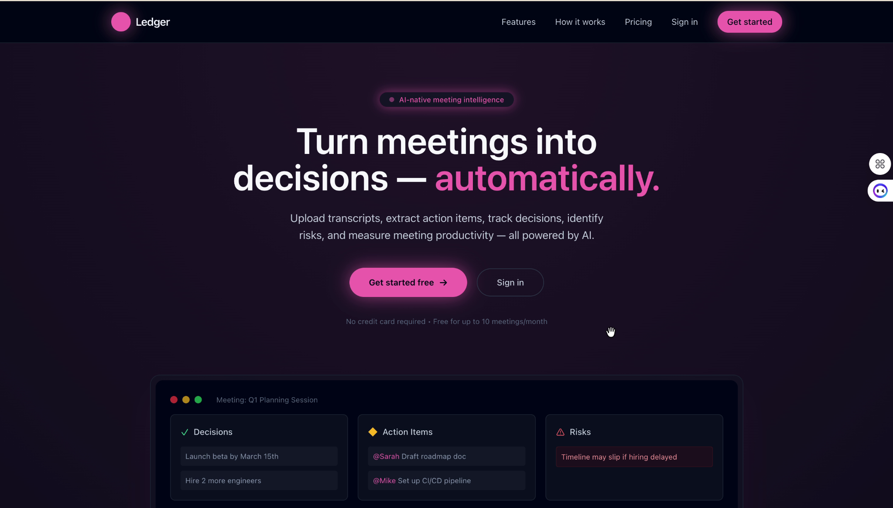
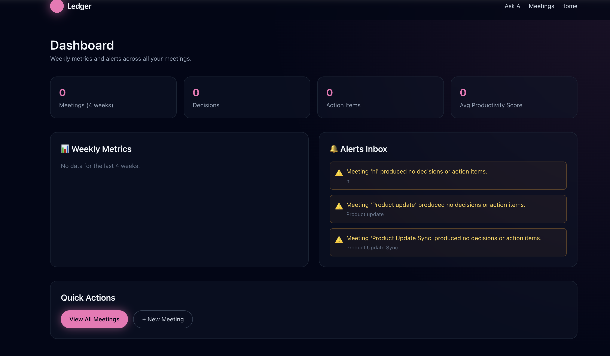
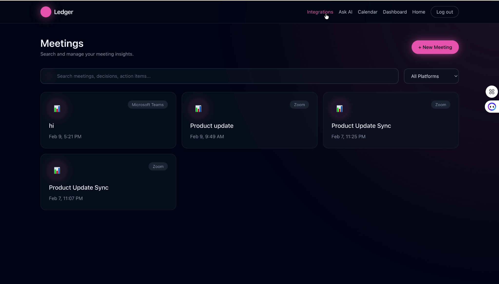
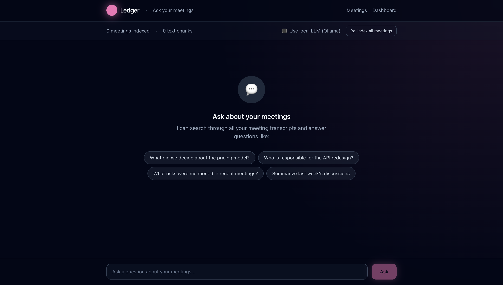
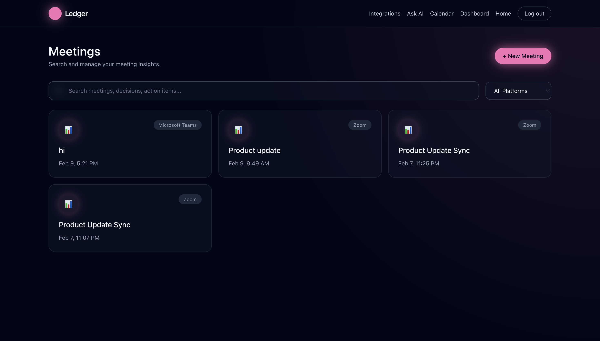
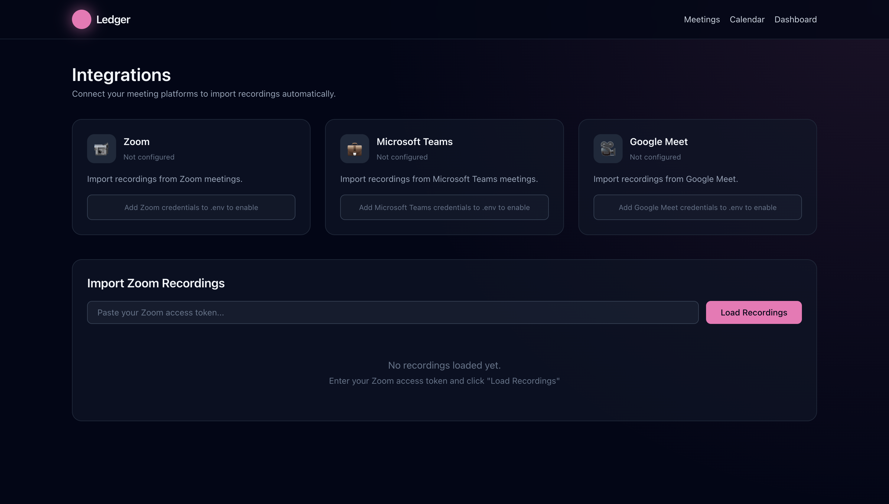

# Ledger — AI-Native Meeting Intelligence Platform

Ledger is an **AI-native meeting intelligence platform** that converts unstructured meeting conversations into **structured, persistent, and actionable business outcomes**.

It captures meeting metadata and transcripts, applies **large language models (LLMs)** to extract **decisions and action items**, and stores them in a **scalable system of record** designed for productivity analytics, accountability, and workflow automation.

Ledger is architected as a **distributed, service-oriented system**, not a chatbot or UI-only application.

## 📸 Product Screenshots

### Mome
How it works, Pricing, Get Started, Features.


### Dashboard
High-level productivity metrics, alerts, and weekly insights across meetings.



### Meetings
View and manage meetings with extracted insights.




### Ask AI
Ask natural language questions across all meetings.



### Calendar
Track meetings and insights by date.



### Integrations
Connect Zoom, Microsoft Teams, and Google Meet.




---

## Key Highlights 

* AI-powered information extraction using LLMs
* RESTful APIs built with FastAPI
* Modular backend architecture with service and worker layers
* SQL-based relational data modeling (SQLAlchemy ORM)
* Fault-tolerant AI integration with graceful degradation
* OpenAPI / Swagger-driven API documentation
* Designed for scalability, extensibility, and production hardening

---

## Problem Statement

Meetings generate critical business decisions and commitments, but these outcomes are often:

* undocumented
* scattered across tools
* difficult to track or audit

Ledger addresses this gap by acting as a **canonical intelligence layer** that reliably transforms conversational data into **structured, queryable artifacts**.

---

## System Capabilities

### 1. Data Ingestion Layer

* Meeting creation and participant management
* Transcript ingestion via REST APIs
* Decoupled capture mechanism (SDK-ready architecture)
* **Audio/Video Upload:** Upload recordings and auto-transcribe with OpenAI Whisper or local Whisper

### 2. AI Intelligence Layer

* LLM-driven extraction of:
  * decisions
  * action items
* Structured JSON output for downstream processing
* Provider-agnostic design (OpenAI + fallback engine)
* **Ask AI:** Query meeting history using Retrieval-Augmented Generation (RAG)

### 3. Persistence & Data Modeling

* Normalized relational schema
* Entities include:
  * meetings
  * participants
  * transcripts
  * decisions
  * action items
* Designed for traceability, accountability, and analytics

### 4. Reliability & Error Handling

* External AI treated as an unreliable dependency
* Call-time exception handling
* Automatic deterministic fallback logic
* No system-wide failures due to AI quota, auth, or network issues

---

## High-Level Architecture

```
Client (React UI / Swagger / cURL)
        |
        v
API Layer (FastAPI Routers)
        |
        v
Service Layer (AI Extraction, Integrations)
        |
        v
LLM Provider (OpenAI / Ollama / Fallback)
        |
        v
Persistence Layer (SQLAlchemy ORM)
```

**Design principles:**

* separation of concerns
* fail-safe AI integration
* extensibility over tight coupling

---

## Project Structure

```
backend/
├── app/
│   ├── api/            # REST API routers
│   ├── db/             # ORM models and DB session
│   ├── services/       # AI and business logic
│   ├── workers/        # Background-style processing
│   └── main.py         # Application entrypoint
├── requirements.txt
└── Dockerfile

frontend/
├── src/
│   ├── pages/          # React pages (Meetings, Calendar, Integrations, etc.)
│   ├── lib/            # API utilities
│   └── App.tsx         # Router and layout
├── public/
├── package.json
└── README.md
```

---

## API Overview

### Meetings API

* `POST /meetings` — Create meetings with participant metadata

### Transcripts API

* `POST /transcripts` — Store raw meeting transcripts

### AI Extraction API

* `POST /extract` — Trigger AI-based extraction pipeline

### Audio Upload API

* `POST /upload/audio` — Upload audio/video files for transcription

### Integrations API

* `GET /integrations/zoom/recordings` — List Zoom cloud recordings
* `POST /integrations/zoom/import` — Import Zoom recording/transcript

Interactive documentation available via **Swagger UI**:

```
http://127.0.0.1:8000/docs
```

---

## Frontend Capabilities

* **Meetings Dashboard:** Create, view, and search meetings
* **Calendar View:** Visualize meetings by date
* **Meeting Detail:** View transcript, decisions, actions, risks, participants
* **Audio Upload:** Upload and transcribe recordings
* **Integrations Page:** Connect Zoom, Teams, Google Meet and import recordings
* **Ask AI:** Query meeting history with RAG
* **PDF Export:** Download meeting summaries
* **Email Notifications:** Automatic email summaries and action item assignments

---

## AI Processing Pipeline

1. Transcript fetched from relational database
2. Text passed to AI extraction service
3. LLM returns structured JSON:
   * decisions
   * action items
4. Results persisted transactionally
5. On AI failure:
   * fallback extraction used
   * API returns success
   * system state remains consistent

---

## Fault Tolerance Strategy

Ledger implements **defensive AI integration**:

* AI calls wrapped in exception handling
* Quota, authentication, and provider failures handled gracefully
* Deterministic fallback ensures:
  * system availability
  * demo reliability
  * production safety

This approach mirrors real-world **resilient distributed systems**.

---

## Technology Stack

* **Backend:** FastAPI
* **ORM:** SQLAlchemy
* **Database:** SQLite (development)
* **AI / NLP:** OpenAI API (pluggable), Ollama (local LLM)
* **API Spec:** OpenAPI / Swagger
* **Frontend:** React + TypeScript + Tailwind CSS
* **Language:** Python 3.9+, Node.js

---

## Local Development

### Backend

```bash
python3 -m venv venv
source venv/bin/activate
pip install -r requirements.txt
brew install ffmpeg
uvicorn app.main:app --reload
```

Optional AI integration:

```bash
export OPENAI_API_KEY=sk-...
# For local LLM fallback
export USE_OLLAMA=true
ollama serve
```

### Frontend

```bash
cd frontend
npm install
npm run dev
```

---

## Integrations & OAuth

* Add credentials for Zoom, Teams, Google, Slack in `.env`
* Go to Integrations page to connect and import recordings

---

## Scalability & Future Enhancements

* Asynchronous background processing (Celery / Redis)
* Idempotent extraction & versioning
* Confidence scoring and explainability
* PostgreSQL migration
* SDKs for capture (desktop, browser, calendar)
* Team/Organization support

---

## Why This Project Matters

Ledger demonstrates:

* system design thinking
* production-grade backend engineering
* responsible AI integration
* scalable data modeling
* reliability-first architecture

It is designed to evolve into a **core intelligence component** within productivity and enterprise workflow platforms.

---

## License

MIT License

---

## Support

For questions or support, open an issue or contact the maintainer.

---

**Ledger** — Turn meetings into decisions, automatically.

